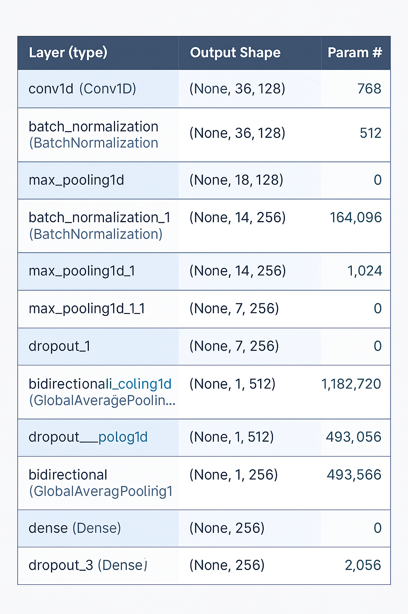
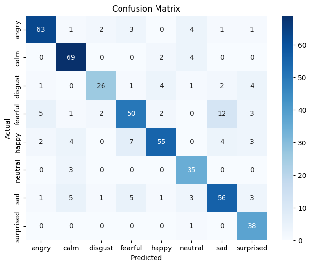

## 🗣️ Emotion Recognition from Speech

A clean and responsive web app developed using **Streamlit** to classify human emotions from `.wav` audio samples using a trained deep learning model based on MFCC features extracted from the **RAVDESS** dataset.

---

## 🔍 Overview

This project combines audio signal processing and deep learning to detect emotions from spoken audio. Users can upload `.wav` files, and the system will analyze them to predict the expressed emotion using a robust neural network.

- **Interactive UI**: Simple drag-and-drop functionality.
- **Fast Results**: Near-instant classification feedback.
- **Well-trained Model**: Built on diverse emotional speech and song data.

---

## 🎼 Dataset: RAVDESS

- The **Ryerson Audio-Visual Database of Emotional Speech and Song**
- Includes recordings of 24 professional actors (12 male, 12 female)
- Covers 8 emotions:
  - `neutral`, `calm`, `happy`, `sad`, `angry`, `fearful`, `disgust`, `surprised`

---

## 🔧 Audio Processing Pipeline

1. **Audio Ingestion**:
   - Files are loaded using `librosa` with a fixed duration of 3 seconds and a 0.5s offset.

2. **Feature Extraction**:
   - Computes 40 Mel-frequency cepstral coefficients (MFCCs)
   - Averages the MFCCs over time to form a (40,) feature vector

3. **Label Handling**:
   - Labels derived from filenames
   - Encoded using One-Hot Encoding for multi-class learning

---

## 🧠 Model Design



### Highlights:
- **CNN Layers**: Detect local patterns in MFCC features
- **Bidirectional GRU**: Captures temporal trends in both forward and backward directions
- **Regularization**: Batch normalization and dropout for generalization
- **Final Layers**: Dense classifier with softmax activation

---

## 📊 Performance Metrics

```plaintext
              precision    recall  f1-score   support

     angry       0.88      0.84      0.86        75
      calm       0.83      0.92      0.87        75
   disgust       0.84      0.67      0.74        39
   fearful       0.76      0.67      0.71        75
     happy       0.86      0.73      0.79        75
   neutral       0.73      0.92      0.81        38
       sad       0.75      0.75      0.75        75
 surprised       0.73      0.97      0.84        39

  accuracy                           0.80       491
 macro avg       0.80      0.81      0.80       491
weighted avg     0.80      0.80      0.80       491
```

---

## 🔁 Confusion Matrix



---

## 🔎 Observations & Key Takeaways

- **Overall Accuracy**: 80%, indicating reliable classification
- **Top Classes**: `calm`, `angry`, and `happy` perform exceptionally well
- **Tricky Emotions**: `disgust` and `fearful` have slightly lower recall, likely due to subtler vocal expressions
- **Balanced Outcomes**: Macro and weighted averages both reflect consistent model behavior

---

## 🌐 Web Application

-💻 How to Run bash Copy Edit cd emotion-detector-app ##*streamlit run app.py * Once launched, open the displayed URL (usually http://localhost:8501) in your browser.
